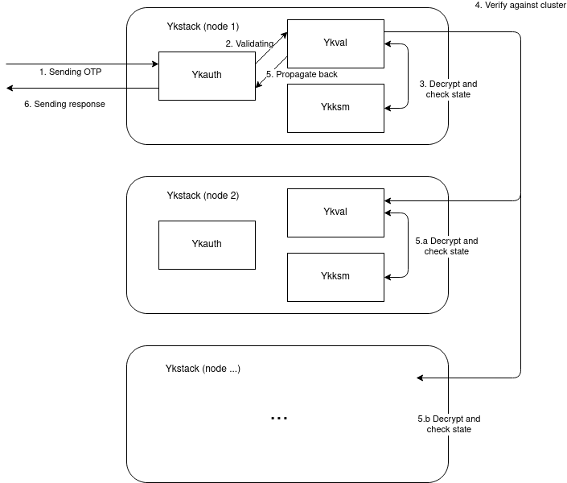

# Architecture design of Booking Yubistack

## Decisions

### Improved reliability
As Site Reliability Engineers at Booking.com, we need to build and maintain multiple systems.
The challenge is to reduce complexity, while not being overwhelmed by the number of systems we manage.

We went for Go as the implementation language, as it reduces complexity by multiple
factors due to its design choices. Key features that made us choose Go:

- Single binary serving direct traffic: this allows us to remove the need of a
    web server (previously our software was using Python and required uWSGI),
    potential intermediary libraries (Python again) and thus removing the need
    for complex configuration management tooling and recipes.
- Simple statically typed language with simple syntax and few features allowing
    developers to quickly jump in the code-base. This may be seen as a nice to have,
    but most of the time we have a tendency to lower the impact of simplicity on our work.
    Simplicity is a long term investment but it pays most of the time.
- Support for concurrency out of the box and excellent support for security primitives
    (TLS, RSA, hashing algorithms).

In addition to these features, we added a few more key reliability concepts:

- Strict code coverage over the entire code-base.
- Extensive unit testing brings confidence and forces developers to properly
design components: It is extremely difficult to test a component that does three or four different things.
Testing forced us to write small components and small functions, making it easy to test and mock.
- Support for proper metrics brings visibility and understanding on how your software is behaving.
- Support for Prometheus as a pluggable middleware, but it can be easily replaced with whatever tool fits your needs the most.

### Improved security

Some parts of the protocol were not secure enough, we identified two big problems which we fixed:
- Cleartext AES key in the database: This is potentially dangerous as this
    critical data can be used to impersonate the Yubikey.
    If an attacker (or any unprivileged user) would ever gain access to the DB,
    it would constitute a major breach requiring a replacement of the entire Yubikey fleet.
    We want confidential data to be stored encrypted.
- IP-based validation of the peers: The current state of upstream Yubico
    implementation is using a pool of nodes defined by IP addresses.
    We consider this fragile and it should not be used for any security based system.

### Simplicity

As people trying to make things reliable, simplicity is our most powerful tool.
This is why we designed our implementation to be as simple as possible.

- Every component lives in the same repository, meaning the maintainer will not have
    to hop between repositories to find documentation or code.
- Modular approach allowing you to plug components to form a single binary.
- Separation of concerns: this may sound obvious but we took great effort in maintaining this aspect.
- Consistent and well documented API, offering predictable output for well defined input.
    We redesigned it using [https://swagger.io/](https://swagger.io/) description DSL.
    This was done for documentation sanity. We are not using any tool to generate code
    as we want to keep abstraction low.

## Flow

Here is a diagram representing the authentication and validation of a token:

Here is a more detailed description of the internal flow:

1. The user send the OTP to validate to Yubistack instance using the HTTP endpoint.
	The Ykauth module is responsible to handle the request, check additional informations
	if needed (user, potentially password). Then it passes the OTP to the Ykval module.
2. Ykval check if the counter is bigger than internal state. It then passes the
	token to the Ykksm module.
3. Ykksm decrypt the token and validate that information is valid.
4. Once the token is validated against the current node state we need to synchronize
	with other nodes.
5. Each node receiving the token for validation perform step 2 and 4 and send
	back the response (token is valid, counter is bigger than internal state).
6. Once a threshold of valid answer is reached, and if no error has been detected.
	The Ykval module propagate the success to the Ykauth module.
7. Ykauth acknowledge the result and send back an HTTP response to the user,
	indicating if the token is valid.
